# F5 Distributed Cloud (XC) Labs – WAAP, Rate Limiting & Bot Defense  
This repository covers hands-on experience with F5 XC security labs:
   - Web App & Api Protection (WAAP) Security: Deployed OWASP Juice Shop, configured WAAP policies, and tested API protection. 
   - Bot Defense: Implemented signature-based bot detection, protected endpoints, and validated mitigation.

## **1️⃣ Introduction**  
As part of my hands-on journey with **F5 Distributed Cloud (XC)**, I explored advanced security features through two in-depth labs focused on:  

✅ **Web Application & API Protection (WAAP)**  
✅ **Rate Limiting & Service Policies**  
✅ **Bot Defense & Automated Threat Mitigation**  

These labs provided practical insights into securing web applications, fine-tuning WAAP policies, detecting malicious users, protecting APIs, mitigating bot-driven threats, and enforcing service policies with rate limiting.  

---

## **2️⃣ Lab Environment & Setup**  

Before diving into the security configurations, I set up the lab environment:  

### **🔹 Lab Access & Authentication**
- Logged into the **Westcon Lab console powered by cloudshare**

  
  
  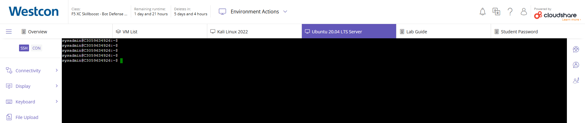
  
  

- Logged into the **F5 Distributed Cloud (XC) console** and familiarized myself with the **XC dashboard & security configurations**

  
  
  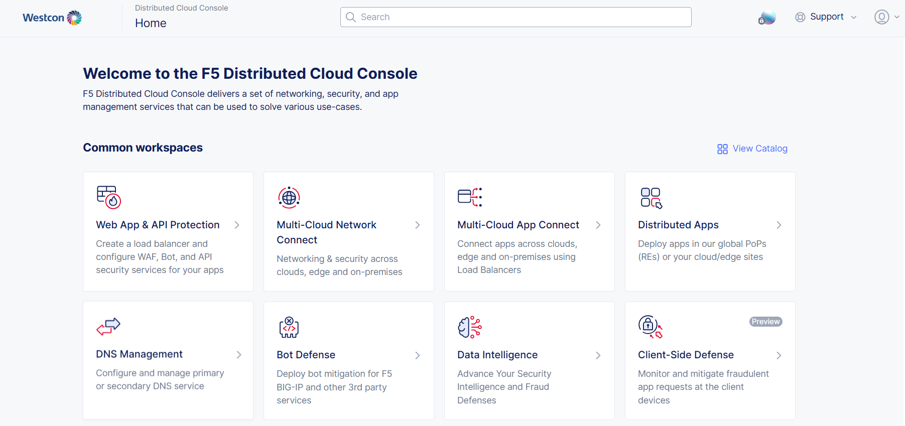
  
  

## **3️⃣ Lab 1: Web Application & API Protection (WAAP) + Rate Limiting**  

### **📌 Publishing & Protecting a Web Application**
- Deployed the **OWASP Juice Shop** a vulnerable web application used for security testing on **F5 XC**
  
  
  
  
  
  
  
  
  
  
  
  
  
  
  
  
  
  
  
  

  
### **🛡️ Enabling and configuring WAAP & Malicious User Detection policies**to safeguard against threats
- Enabled and customized **WAAP policies**  
- Simulated real-world **exploits** to test the security posture  
- Identified and analyzed **malicious user behavior**

  
  
  
  
  
  
  
  
  
  
  
  
  
  
  
  
  
  
  
  
  
  
  
  
  
  
  
  
  
  
  

### **🔍 API Discovery & Endpoint Protection**
- Used **API Discovery** to map exposed APIs  
- Defined API security policies to protect endpoints from abuse
  
### **🚦 Applying Service Policies & Rate Limiting**
- **Configured service policies** to enhance application security  
- Implemented **IP Reputation Filtering** to block known malicious IPs  
- Applied **Rate Limiting** policies to prevent API abuse  
- Tested rate limits by simulating high request traffic  

## **4️⃣ Lab 2: Bot Defense & Protection**  

### **🤖 Signature-Based Bot Defense**
- Tested **signature-based bot detection** mechanisms  
- Differentiated between **good bots & malicious bots**  

### **🔐 Protecting Application Endpoints**
- Applied bot defense policies to **specific API endpoints**  
- Evaluated bot mitigation effectiveness
  

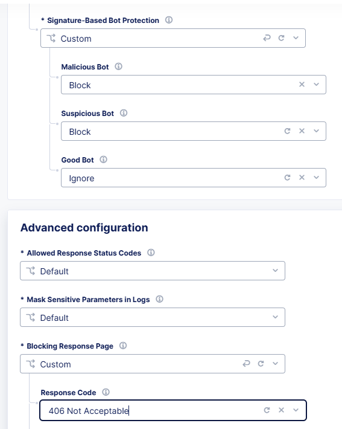

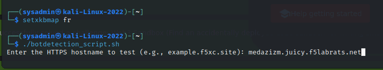

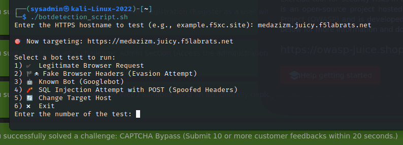

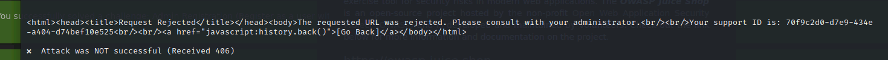

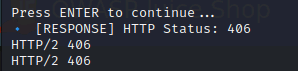

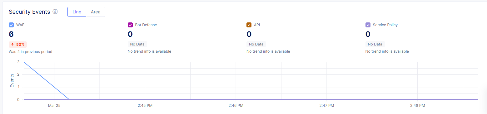

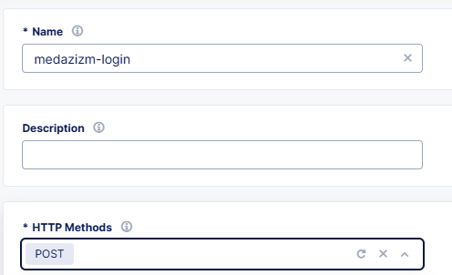

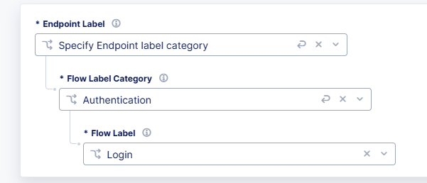

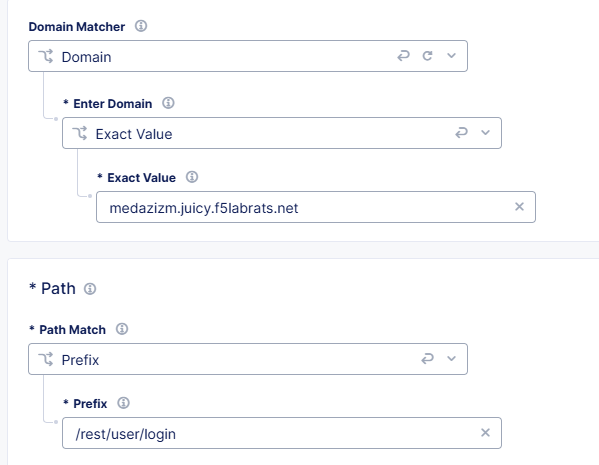

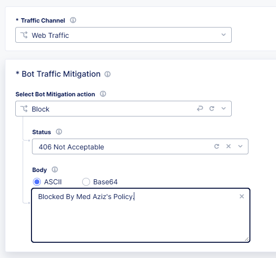

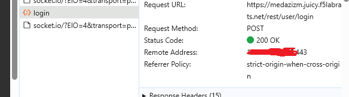

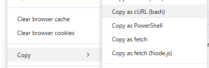

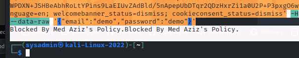

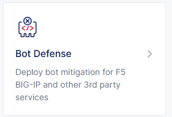

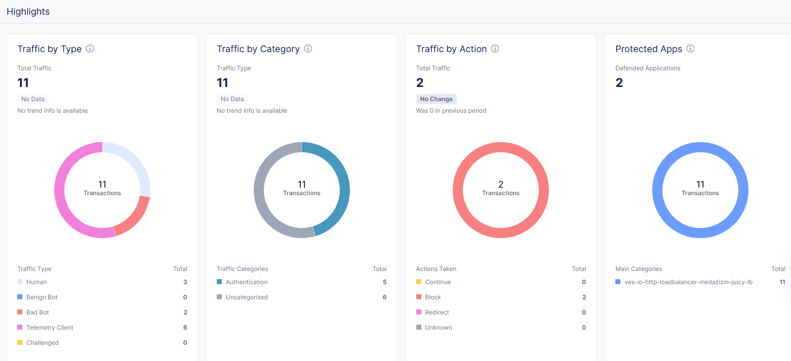

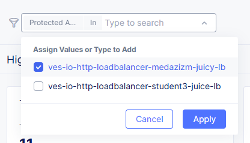

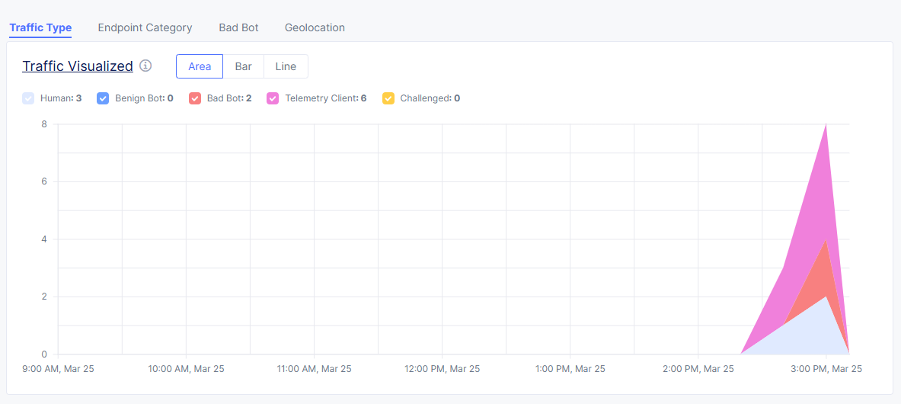

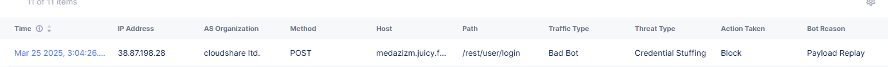

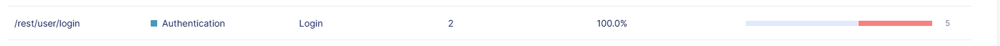

## **5️⃣ Key Takeaways & Learnings**  
- **F5 XC WAAP** effectively protects web applications from the OWASP Top 10 and other threats.  
- **API Security & Discovery** is essential for safeguarding modern applications.  
- **Bot Protection** helps prevent automated abuse and credential stuffing.  
- **Rate Limiting & Service Policies** mitigate API abuse and protect resources.  

 

## **Conclusion**  
This hands-on experience solidified my understanding of **F5 Distributed Cloud Security**, equipping me with the expertise to deploy and fine-tune security policies, mitigate API threats, counteract bot-driven attacks, and apply service policies to enforce **rate limiting** and **IP reputation filtering**.  
