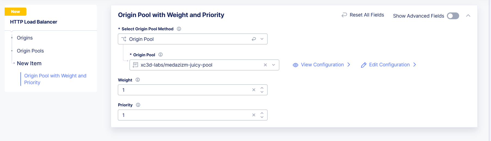
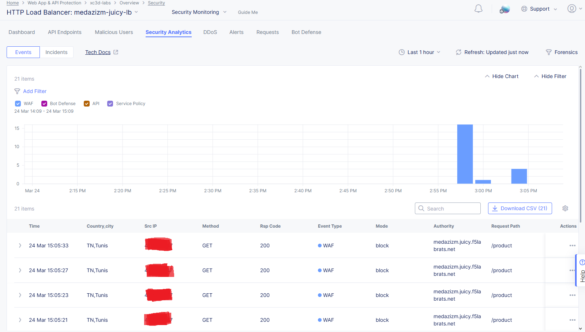
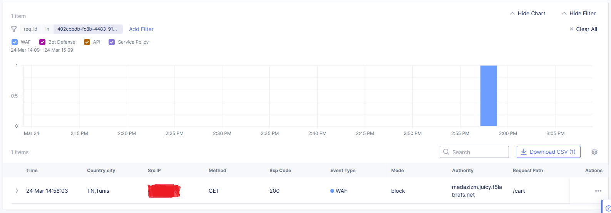
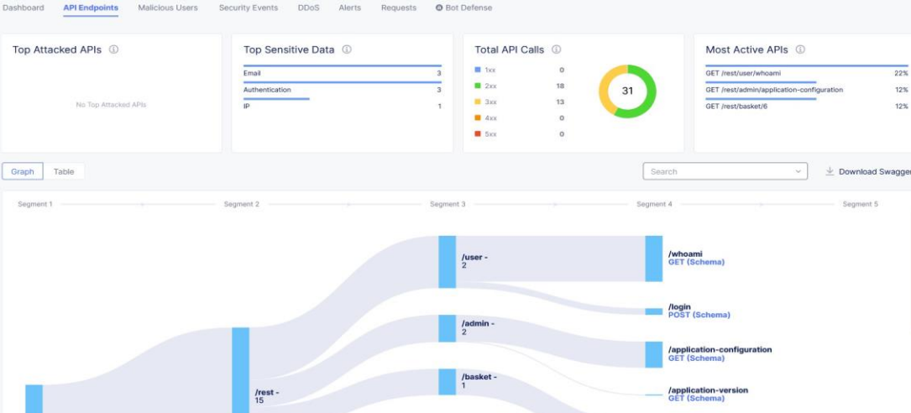

# 🔒 F5 Distributed Cloud (XC) Labs – WAAP, Rate Limiting & Bot Defense  

This repository presents a comprehensive hands-on experience with **F5 Distributed Cloud (XC)** security labs, focusing on:  
   - **Web Application & API Protection (WAAP):** Deployment of OWASP Juice Shop, configuration of WAAP policies, and API protection testing.  
   - **Bot Defense:** Implementation of signature-based bot detection, protection of endpoints, and validation of mitigation mechanisms.  

---

##  Table of Contents  

- [1️⃣ Introduction](#1️⃣-introduction)  
- [2️⃣ Lab Environment & Setup](#2️⃣-lab-environment--setup)  
  - [Lab Access & Authentication](#-lab-access--authentication)  
- [3️⃣ Lab 1: Web Application & API Protection (WAAP) + Rate Limiting](#3️⃣-lab-1-web-application--api-protection-waap--rate-limiting)  
  - [Publishing & Protecting a Web Application](#publishing--protecting-a-web-application)  
  - [Enabling and Configuring WAAP & Malicious User Detection Policies](#enabling-and-configuring-waap--malicious-user-detection-policies)  
  - [API Discovery & Endpoint Protection](#api-discovery--endpoint-protection)  
  - [Applying Service Policies & Rate Limiting](#applying-service-policies--rate-limiting)  
- [4️⃣ Lab 2: Bot Defense & Protection](#4️⃣-lab-2-bot-defense--protection)  
  - [Signature-Based Bot Defense](#signature-based-bot-defense)  
  - [Protecting Application Endpoints](#protecting-application-endpoints)  
- [5️⃣ Key Takeaways & Learnings](#5️⃣-key-takeaways--learnings)  
- [Conclusion](#conclusion)  

---

## **1️⃣ Introduction**  
As part of my hands-on journey with **F5 Distributed Cloud (XC)**, I explored advanced security features through two in-depth labs focused on:  

- **Web Application & API Protection (WAAP)**  
- **Rate Limiting & Service Policies**  
- **Bot Defense & Automated Threat Mitigation**  

These labs provided practical insights into securing web applications, fine-tuning WAAP policies, detecting malicious users, protecting APIs, mitigating bot-driven threats, and enforcing service policies with rate limiting.  

---

## **2️⃣ Lab Environment & Setup**  

Before proceeding with security configurations, I established the lab environment as follows:  

### **- Lab Access & Authentication**  
- Logged into the **Westcon Lab console powered by Cloudshare**  

    
    
    

- Accessed the **F5 Distributed Cloud (XC) console** and familiarized myself with the **XC dashboard & security configurations**  

    
    
    

---

## **3️⃣ Lab 1: Web Application & API Protection (WAAP) + Rate Limiting**  

### **Publishing & Protecting a Web Application**  
- Deployed the **OWASP Juice Shop**, a vulnerable web application used for security testing, on **F5 XC**.  

    
    
    
    
    
    
    
    
    
    

---

### **Enabling and Configuring WAAP & Malicious User Detection Policies**  
To safeguard against threats, I:  
- Enabled and customized **WAAP policies**.  
- Simulated real-world **exploits** to test security robustness.  
- Identified and analyzed **malicious user behavior**.  

    
    
    
    
    
    
    
    
    
    
    
    
    
    
    
    

---

### **API Discovery & Endpoint Protection**  
- Leveraged **API Discovery** to map exposed APIs.  
- Defined API security policies to prevent abuse and ensure protection.  

---

### **Applying Service Policies & Rate Limiting**  
- Configured **Service Policies** to enhance application security.  
- Implemented **IP Reputation Filtering** to block known malicious IPs.  
- Applied **Rate Limiting policies** to prevent API abuse and simulated high-traffic scenarios to validate configurations.  

    
    
    
    

---

## **4️⃣ Lab 2: Bot Defense & Protection**  

### **Signature-Based Bot Defense**  
- Tested **signature-based bot detection mechanisms**.  
- Differentiated between legitimate bots and malicious automated traffic.  

---

### **Protecting Application Endpoints**  
- Applied **bot defense policies** to specific API endpoints.  
- Evaluated effectiveness through mitigation logs and dashboard statistics.  

   to   

---

## **5️⃣ Key Takeaways & Learnings**  

- **F5 XC WAAP** effectively protects web applications from the **OWASP Top 10** and other sophisticated threats.  
- **API Security & Discovery** are essential components of modern application protection.  
- **Bot Protection** mechanisms mitigate automated abuse, credential stuffing, and scraping.  
- **Rate Limiting & Service Policies** are vital for API abuse prevention and resource management.  

---

## **Conclusion**  

This hands-on experience solidified my understanding of **F5 Distributed Cloud Security**. It equipped me with the expertise to deploy and fine-tune security policies, mitigate API threats, counteract bot-driven attacks, and apply service policies for enforcing **rate limiting** and **IP reputation filtering**.  

